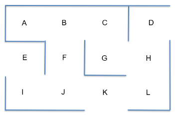

# Q-learning - Reinforcement learning 
In this project I explore Q-learning for optimizing warehouse flows. We are given a task to find the shortest path from one point to another in a grid given below.

To solve this task a reinforcement technique is used. Q-learning is based on Markov's decision processes. Here the problem is solved in three steps, where in the first place environment is defined, then Q-learning algorithm is implemented and finally it is put into a production. We can also define an intermidiary point where the robot needs to pass before reaching the destination. 

Q-learning is a model-free reinforcement learning algorithm this means it can handle problems with stochastic transitions and rewards without requiring adaptations. 
